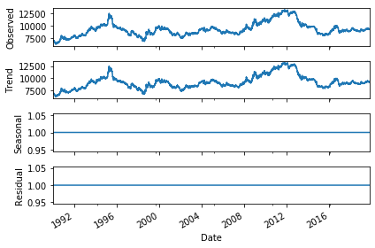
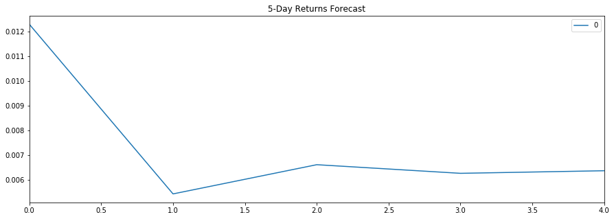
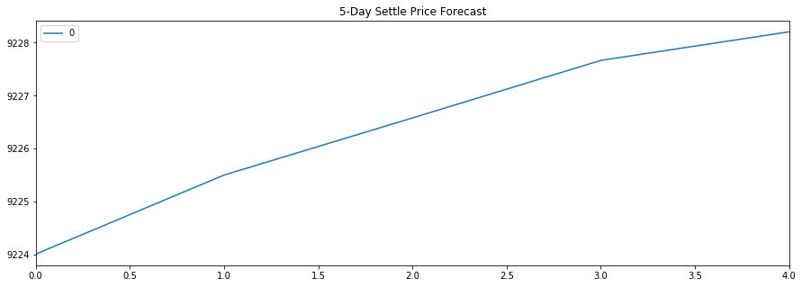

# JPY-USD: A Time Series and Linear Regression Analysis

## JPY-USD Pattern 1990-2019

The value of the Japanese Yen (JPY) against the US Dollar (USD) fluctuates by relatively small amounts on a daily basis. However, visually there seems to be a up-down pattern in-between years (medium term). Looking at the long term-horzon, the value of the JPY vs USD increased from about ~7000 to ~9400 from 1900 to 2019. Interestingly when decomposed, the JPY/USD time series does not exhibit any seasonality.

## HP Filter Decomposition
### 1. Trend Analysis
The HP filter trend plotted against the actual settle price of the JPY

### 2. Noise Analysis

## Forecasting Returns Using ARMA Model

The p-values at 95% CI, for each of the terms of the model are way above 0.05, indicating the model is not a good fit and one cannot conclude that the coefficients are statistically significant.

However, if the ARMA model takes an autoregressive order of 1 instead, we see the terms of the model being statistically significant, which is consistent with what the partial autocorrelation plot suggests.

## Forecasting Settle Price Using ARIMA Model

The ARIMA model (using an autoregressive order of 5, moving average order of 1, and difference degree of 1) forecasts the JPY (vs USD) to increase in value by 4 in the next 5 days. However, the forecast should be taken with precaution as the model is not a good fit. The p-values of the model's terms, way above 0.05, are not statistically significant.

## Forecasting Volatility with GARCH

The GARCH model, with an autoregressive order of 2 and moving average order of 1, forecasts an increase of the exchange rate risk of JPY against the USD.

All terms of the model are statistically significant, except for the coefficient of lag 2, show some goodness of fit relative to the ARMA and ARIMA models. Having said that, performing a time series analysis on these models cannot confidently conclude whether the yen is a good buy.

## Predicting Returns Using Linear Regression

Looking at the root mean squared errors (RMSE), the model performed better on the out-of-sample data with RMSE of 0.4155 compared to in-sample data with RMSE of 0.5962. Normally, training data has lower RMSE, but interestingly it has higher RMSE in this model.