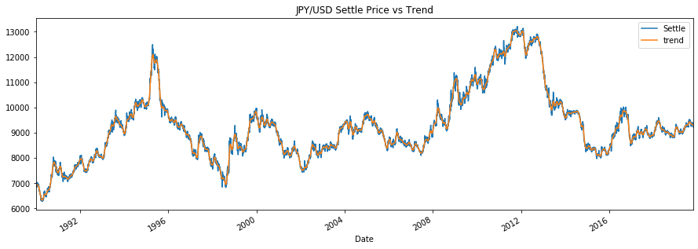
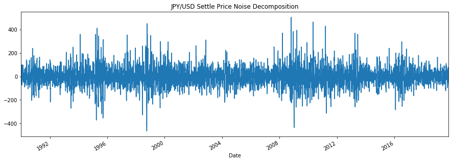
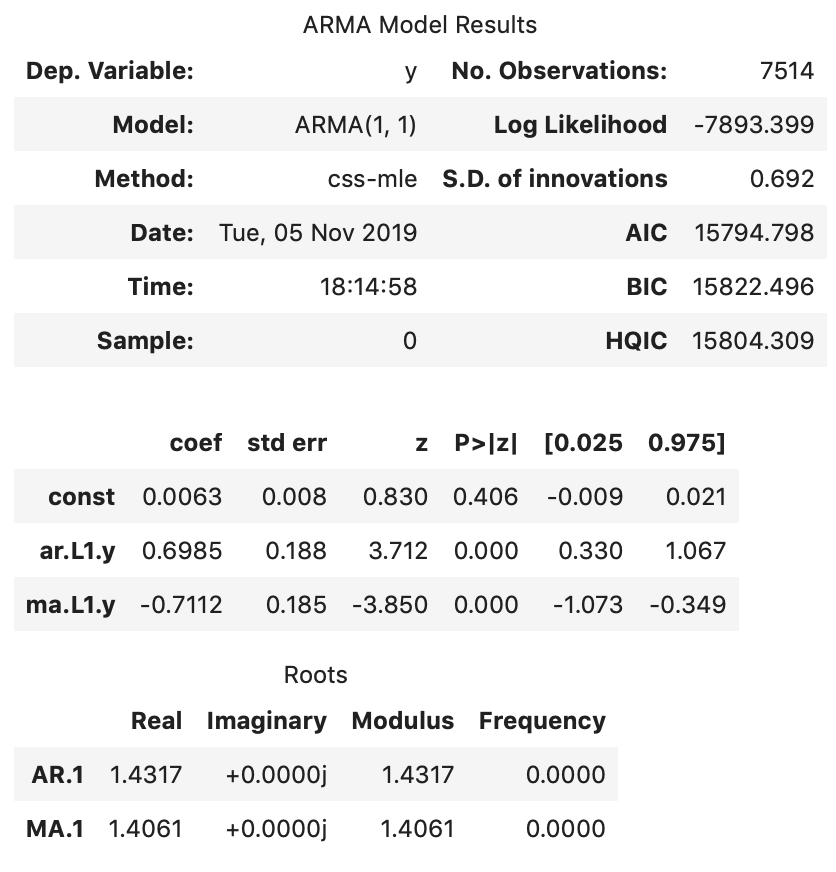
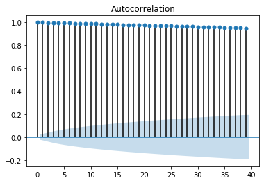
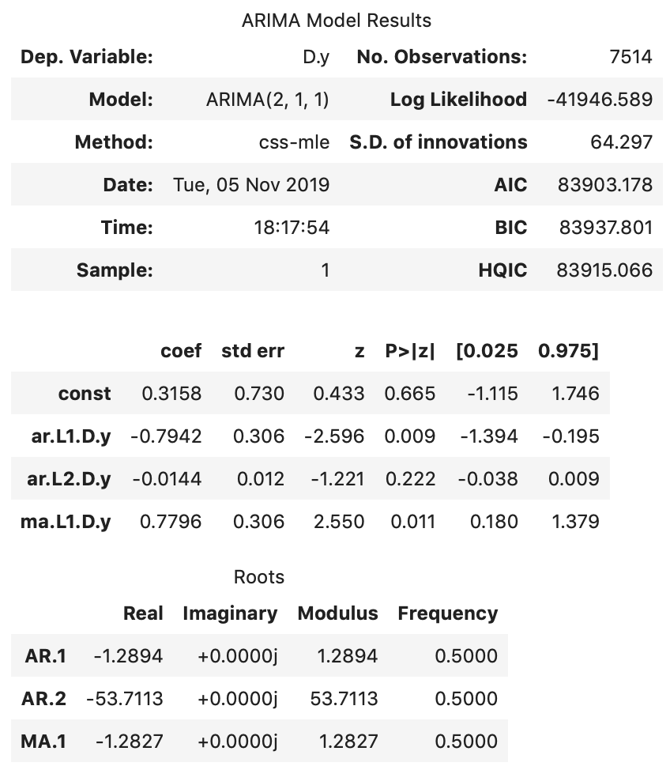
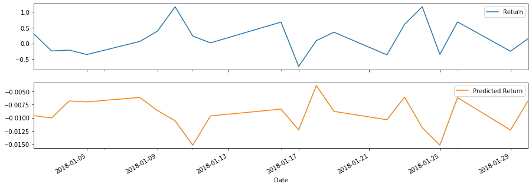

# JPY-USD: A Time Series and Linear Regression Analysis

This analysis takes a look at the applicability of various modeling techniques to predict the values of the Japanese Yen against the dollar. Specifically, techniques applied include:
* Seasonal Decomposition to determine seasonality of the series
* HP Filter Decomposition to determine trend and cyclicality
* ARMA to model the stationarized version of the time series by transforming the Settle price to percentage change
* ARIMA to model the Settle price
* GARCH to model the volatility of the JPY
* Linear regression to model using lagged return of the JPY

## JPY-USD Pattern 1990-2019

The value of the Japanese Yen (JPY) against the US Dollar (USD) fluctuates by relatively small amounts on a daily basis. However, visually there seems to be a up-down pattern in-between years (medium term). Looking at the long term-horzon, the value of the JPY vs USD increased from about ~7000 to ~9400 from 1900 to 2019. Interestingly when decomposed, the JPY/USD time series does not exhibit any seasonality, making it ideal for AR(I)MA modeling.

## HP Filter Decomposition
### 1. Trend Analysis
Removing the short-term fluctuations of the JPY time series using the HP filter reveals long term trends, and perhaps some valuable insights to the value of the currency through time. For example, towards the end of 2011, we see some big fluctuations around the trend, suggesting opportunities for a sell (when the actual price is above the trend) or a buy (when the actual price was below the trend).

### 2. Noise Analysis
On the other hand, we see the short-term fluctuations in the HP noise plot. Similar to the analysis of the trend, when the fluctuation is above zero presents a sell, and below a buy opportunity.

## Forecasting Returns Using ARMA Model

The model results show the coefficients are relatively close to zero and that the P-Values in ‘P>|z|’ column are highly insignificant, with values way above 0.05. One can conclude that the model does not provide a good fit for the data.

However, if the ARMA model takes an autoregressive order of 1 (lag of 1 day) instead, we see both the AR and MA terms improving, having statistically significant coefficients with p-values close to zero, less than 0.05.

This is consistent with what the partial autocorrelation plot of the stationarized Settle returns data suggests. Similarly, looking at the autocorrelation plot, MA order of 1 is appropriate. However, one should take caution with the constant term as it is still insigficant.

## Forecasting Settle Price Using ARIMA Model

The ARIMA model (using 5 days of lag, 1 day of lag for forecasted error, and 1 day of difference degree) forecasts the JPY (vs USD) to increase in value by 4 in the next 5 days. However, the forecast should be taken with precaution as the model is not a good fit for the data. The constant term, the coefficients of the lags and the forecasted error lag are all statistcally insignificant, with p-values way more than 0.05.

The partial autocorellation plot of the Settle price data shows 2 lags crossing the significance limit. The autocorrelation plot confirms the appropriateness of using order 1 for the MA term.

Implementing this analysis into our ARIMA model by changing the AR order to 2 instead of 5, we see the coefficients of the 1st day lag and the forecasted error term now being statistically significant. However, coefficient of the 2nd day lag and the constant term remain insignificant.

## Forecasting Volatility with GARCH

The GARCH model, with an autoregressive order of 2 and moving average order of 1, forecasts an increase of the exchange rate risk of JPY against the USD. 

All terms of the model are statistically significant, except for the coefficient of lag 2, show some goodness of fit relative to the ARMA and ARIMA models.

Having said that, performing a time series analysis on these models cannot confidently conclude whether the yen is a good buy.

Even after implementing the AR orders, as suggeseted by the PACF plots, not all the coefficients of the models' terms improved in statistical significance. The results of the model suggests using precaution in using these models to trade JPY.

## Predicting Returns Using Linear Regression

Looking at the square root of the variance of the residuals, root mean squared errors (RMSE), we can see how close the observed data points are to the model's predicted values. With a lower RMSE of 0.4155, we see that the model performed better on the out-of-sample data compared to in-sample data with an RMSE of 0.5962. Normally, training data has lower RMSE, but interestingly it has higher in this model.